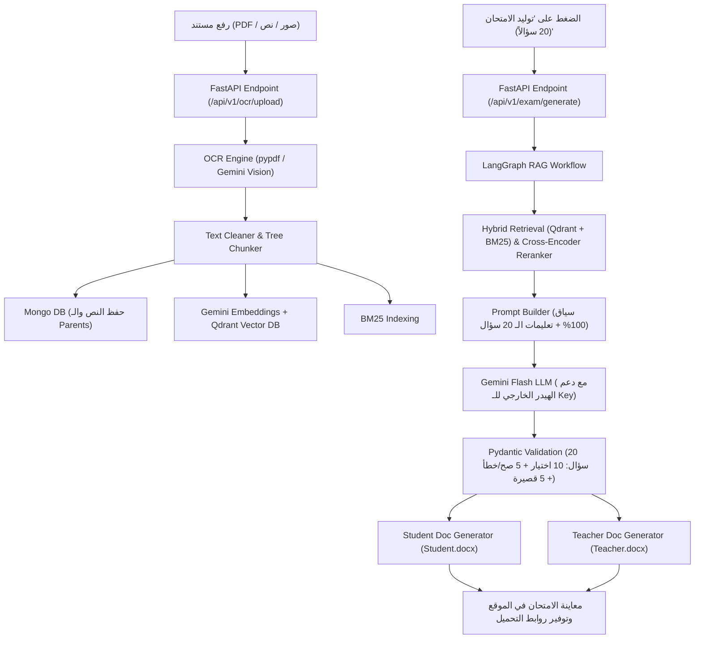

# 📚 الدليل الشامل والمعماري لمشروع منصة توليد الامتحانات الذكية (Quiz Maker AI SaaS)

---

## 🌟 1. مقدمة ونظرة عامة عن المشروع (Project Overview)

مشروع **Enterprise Arabic Exam SaaS (Quiz Maker)** هو منصة ذكاء اصطناعي متكاملة ومخصصة للمؤسسات التعليمية والمعلمين، تهدف إلى تحويل المستندات والدروس العربية (سواء كانت صوراً، ملفات PDF، أو نصوصاً مباشرة) إلى امتحانات قياسية وشاملة مكونة من **20 سؤالاً محكماً** مع نموذج إجابة نموذجي مرجعي ودليل إرشادي للمعلم، مع إمكانية تنزيلها كمستندات Word جاهزة للطباعة بنسختين (`Student.docx` و `Teacher.docx`).

يعتمد النظام على بيئة **Hybrid RAG** (استرجاع هجين يجمع بين البحث المتجهي والبحث الدلالي الكلمي وإعادة الترتيب الذكي) لضمان **عدم التوهيم (Zero Hallucination)** والالتزام التام بنسبة 100% بنص الدرس المرفق.

---

## 🚀 2. الخدمات الرئيسية المتاحة بالمنصة (Platform Services & Capabilities)

1. **خدمة استخراج وتطهير النصوص (OCR & Text Extraction Service)**:
   - استقبال صور صفحات الدروس والكتب بجميع الصيغ (`PNG, JPG, JPEG`).
   - استقبال مستندات الـ `PDF` واستخراج النصوص منها مباشرة عبر `pypdf` مع دعم الـ OCR الاحتياطي.
   - تطبيق معالجة وتنظيف احترافي للنص العربي (`text_cleaner`) لإزالة الشوائب وتوحيد الأحرف وحفظ سياق الفقرات الكبيرة (Parent Chunks) والفقرات الفرعية (Child Chunks).

2. **خدمة الفهرسة والبحث الهجين (RAG Indexing & Retrieval Service)**:
   - توليد تضمينات متجهية دلالية (Dense Embeddings) باستخدام نموذج `gemini-embedding-001` أو `text-embedding-004`.
   - تخزين المتجهات في قاعدة متجهات **Qdrant Vector Database**.
   - تطبيق البحث بالكلمات المفتاحية **BM25 Search** للحصول على أدق المطابقات اللفظية.
   - إدماج النتائج عبر خوارزمية **Reciprocal Rank Fusion (RRF)** وإعادة الترتيب بـ **Cross-Encoder Reranker**.

3. **خدمة توليد الامتحان القياسي الشامل (Exam Generation Engine)**:
   - **20 سؤالاً تلقائياً**: 10 أسئلة اختيار من متعدد (MCQ) + 5 أسئلة صح أم خطأ (True/False) + 5 أسئلة قصيرة ومقالية (Short Answer).
   - **توزيع الصعوبة الموزون**: 50% أسئلة ميسرة (10 أسئلة سهلة) + 25% فهم واستنتاج (5 أسئلة متوسطة) + 25% تحليل ونقد (5 أسئلة صعبة).
   - صياغة إجابة نموذجية مع اقتباس مباشر من النص وصياغة تفسير مرجعي لكل سؤال.

4. **خدمة توليد مستندات وورد المنسقة (Word Document Generation Service)**:
   - إنشاء ملف **ورقة امتحان الطالب (`Student.docx`)** منسق باللغة العربية اتجاه من اليمين لليوم (RTL) وجاهز للطباعة.
   - إنشاء ملف **نموذج إجابة المعلم (`Teacher.docx`)** يتضمن جدولاً تفصيلياً بالإجابة النموذجية والتفسير المرجعي والدرجة المخصصة لكل سؤال.

5. **إدارة مفاتيح الـ API الديناميكية (Dynamic API Key Management)**:
   - إمكانية تغيير وتغذية مفتاح **Gemini API** من واجهة المستخدم مباشرة عند استهلاك الكوتا.
   - حفظ المفتاح في `localStorage` وإرساله عبر الهيدر `X-Gemini-API-Key` ديناميكياً لجميع العمليات.

---

## 🛠️ 3. التقنيات والخدمات المستخدمة (Technology Stack & Services)

| المجال / التقنية | اسم المكتبة / الخدمة (Technology/Library) | الدور والخدمة المؤداة في المشروع (Role & Purpose) |
| :--- | :--- | :--- |
| **إطار العمل الخلفي (Backend)** | `FastAPI` (Python 3.11) | بناء الـ RESTful APIs وسرعة معالجة الطلبات غير المتزامنة (Async Execution). |
| **خادم التطبيق (Application Server)** | `Uvicorn` | خادم ASGI عالي الأداء لتشغيل تطبيق FastAPI داخل Docker. |
| **الذكاء الاصطناعي الرئيسي (Primary LLM)** | `Google Gemini API` (`gemini-2.5-flash-lite`, `gemini-2.5-flash`) | صياغة الأسئلة ونموذج الإجابة واستخراج الـ OCR المتطور للصور. |
| **الذكاء الاصطناعي المحلي (Local LLM Fallback)** | `Ollama` (`Qwen2.5:1.5b` / `Phi-3`) | خيار تشغيل محلي مجاني تماماً وبدون كوتا أو إنترنت. |
| **محرك تضمين المتجهات (Embeddings)** | `Gemini Embedding API` (`text-embedding-004`) | تحويل الفقرات والنصوص إلى متجهات دلالية بعدد 768 بُعداً. |
| **قاعدة المتجهات (Vector DB)** | `Qdrant` | تخزين المتجهات والبحث الدلالي السريع وتصفية الفقرات حسب الدرس. |
| **البحث بالكلمات (Keyword Search)** | `Rank-BM25` | تطبيق البحث النصي الكلاسيكي الدقيق بالكلمات المفتاحية العربية. |
| **إعادة الترتيب (Re-ranking Engine)** | `FlashRank` / `Cross-Encoder` | إعادة ترتيب نتائج البحث المدمجة من Qdrant و BM25 واختيار الأشد صلة. |
| **أوركسترا الـ RAG (Workflow Manager)** | `LangGraph` (`StateGraph`) | إدارة مراحل التوليد (استرجاع -> إعادة ترتيب -> بناء Prompt -> توليد -> تحقق). |
| **قاعدة بيانات المستندات (Document DB)** | `MongoDB` (`Motor` Async Driver) | تخزين الدروس المؤرشفة، الفقرات الأصلية (Parents)، والامتحانات المنشأة. |
| **التخزين المؤقت والرسائل (Cache & Broker)** | `Redis` & `Celery` | دعم الجداول والعمليات المؤجلة والتخزين المؤقت للبيانات. |
| **استخراج الـ PDF (PDF Parser)** | `pypdf` | قراءة واستخراج النصوص العربية المباشرة من ملفات الـ PDF بسرعة عالية. |
| **المعالجة البصرية للصور (Image Processing)** | `OpenCV`, `Pillow (PIL)`, `Pytesseract` | تحسين جودة الصور والمعالجة الأولية وتطهير تباين النصوص قبل الـ OCR. |
| **توليد مستندات وورد (Word Doc Generator)** | `python-docx` | إنشاء وجدولة وتنسيق ملفات `.docx` باللغة العربية والاتجاه اليمين لليسار. |
| **التحقق من البيانات (Data Validation)** | `Pydantic v2` | تعريف الهياكل والأنماط (Schemas) والتحقق الإجباري من مدخلات ومخرجات النظام. |
| **واجهة المستخدم (Frontend)** | `HTML5`, `CSS3` (Glassmorphism), `Vanilla JS` | واجهة تفاعلية خفيفة وجذابة تدعم السحب والإسقاط وإدارة مفتاح الـ API. |
| **الحاويات والتنفيذ (Containerization)** | `Docker` & `Docker Compose` | حزم وحزم جميع الخدمات (API, Qdrant, MongoDB, Redis) وتدشينها بأمر واحد. |

---

## 📁 4. الهيكل الكامل للملفات والمجلدات (Project Directory & File Structure)

```text
Quiz Maker/
├── Dockerfile                         # ملف بناء صورة Docker الخاصة بالتطبيق وتثبيت الاعتمادات
├── docker-compose.yml                 # ملف ربط وتشغيل الحاويات (API, Qdrant, MongoDB, Redis)
├── requirements.txt                   # جميع مكتبات واعتمادات بايثون المطلوبة للمشروع
├── README.md                          # دليل التشغيل السريع باللغة الإنجليزية
├── run_project.bat                    # سكريبت بنقرة واحدة لتشغيل المشروع على بيئة Windows
├── test_20.py                         # سكريبت اختبار مستقل لتوليد 20 سؤالاً والتحقق من المخرجات
├── PROJECT_DOCUMENTATION.md           # هذا المستند التفصيلي الشامل للمشروع
│
├── app/                               # المجلد الرئيسي لكود التطبيق بالكامل
│   ├── __init__.py
│   ├── main.py                        # نقطة الانطلاق لتطبيق FastAPI وتفعيل الـ CORS والمستندات
│   │
│   ├── api/                           # المجلد الخاص بالنقاط الطرفية (API Endpoints)
│   │   └── v1/
│   │       ├── endpoints/
│   │       │   ├── exam.py            # نقطة توليد الامتحانات /api/v1/exam/generate ودعم الهيدر
│   │       │   ├── ocr.py             # نقطة رفع الملفات والصور /api/v1/ocr/upload والاستخراج
│   │       │   └── download.py        # نقاط تنزيل ملفات الـ Word للطالب والمعلم
│   │       └── router.py              # تجميع مسارات الـ API وتحميلها في التطبيق
│   │
│   ├── core/                          # الإعدادات الأساسية والنواة
│   │   ├── config.py                  # قراءة متغيرات البيئة (.env) وإعدادات Qdrant/Gemini/Mongo
│   │   ├── exceptions.py              # تعريف الأخطاء المخصصة للنظام (Custom Exceptions)
│   │   ├── logging.py                 # نظام السجلات المهيكلة (Structured JSON Logging)
│   │   └── security.py                # إعدادات الأمان والتشفير (إن وجدت)
│   │
│   ├── db/                            # الاتصال بقواعد البيانات
│   │   ├── mongo_client.py            # مدير الاتصال بقاعدة MongoDB لحفظ الدروس والامتحانات
│   │   └── qdrant_client.py           # مدير الاتصال بقاعدة Qdrant وإنشاء الـ Collection
│   │
│   ├── ocr/                           # محرك معالجة واستخراج النصوص
│   │   ├── engine.py                  # محرك استخراج النصوص الموحد (PDF via pypdf + Gemini Vision)
│   │   └── preprocessor.py            # معالجة الصور إلكترونياً (رمادية، إزالة الضوضاء، تباين)
│   │
│   ├── rag/                           # قلب المشروع: محرك الـ RAG الهجين والذكاء الاصطناعي
│   │   ├── tree_chunker.py            # تقطيع النص إلىفقرات كبيرة (Parents) وفقرات فرعية (Children)
│   │   ├── text_cleaner.py            # تطهير النص العربي وتنظيف الحركات والتنقيط والرموز
│   │   ├── embeddings.py              # توليد التضمينات المتجهة عبر Gemini Embedding API
│   │   ├── bm25_indexer.py            # مفهرس البحث النصي الكلمي BM25
│   │   ├── hybrid_retriever.py        # دمج نتائج البحث المتجهي والـ BM25 بعامل دمج RRF
│   │   ├── reranker.py                # إعادة الترتيب بواسطة Cross-Encoder لاختيار أفضل السياقات
│   │   ├── prompts.py                 # الصياغة الصارمة لمنشورات الـ Prompts (Zero Hallucination)
│   │   ├── graph.py                   # خط سير LangGraph StateGraph الموجه لإدارة العملية
│   │   └── ollama_llm.py              # مزود الخدمة المحلي لمجسمات Ollama
│   │
│   ├── schemas/                       # نماذج Pydantic للتحقق من هياكل البيانات
│   │   ├── exam.py                    # هياكل السؤال، كرت الامتحان، توزيع الأنماط والصعوبة
│   │   ├── request.py                 # طلب التوليد وطلب الاستخراج والنص المباشر
│   │   ├── ocr.py                     # نتائج الاستخراج والفقرات المؤرشفة
│   │   └── evaluation.py              # نماذج تقييم جودة الامتحان
│   │
│   ├── services/                      # طبقة الخدمات وإدارة سير العمليات (Service Layer)
│   │   ├── ocr_service.py             # خدمة معالجة المستندات وفهرستها في Qdrant و MongoDB
│   │   ├── exam_service.py            # خدمة تشغيل مسار LangGraph وتوليد ملفات الـ Word
│   │   └── eval_service.py            # خدمة التقييم الدوري وجودة الأسئلة
│   │
│   ├── static/                        # الملفات الثابتة وواجهة المستخدم
│   │   └── index.html                 # واجهة المستخدم الرئيسية (Dashboard + Stepper + Modal API Key)
│   │
│   └── word_gen/                      # محرك منشئ المستندات من نوع Word (.docx)
│       ├── styles.py                  # أنماط الألوان، الحدود، التظليل، والاتجاه العربي RTL
│       ├── student_doc.py             # مولد ورقة أسئلة الطالب (Student.docx)
│       └── teacher_doc.py             # مولد دليل المعلم ونموذج الإجابة (Teacher.docx)
│
└── tests/                             # الاختبارات التلقائية (Unit & Integration Tests)
    ├── conftest.py                    # إعدادات pytest وبيئة الاختبارات
    ├── test_api.py                    # اختبارات نقاط الـ API
    ├── test_hybrid_search.py          # اختبار البحث الهجين
    ├── test_text_cleaner.py           # اختبار تطهير النص العربي
    ├── test_tree_chunker.py           # اختبار التقطيع الهرمي
    └── test_word_generator.py         # اختبار توليد مستندات وورد
```

---

## ⚙️ 5. كيف تعمل كل تقنية وخدمة في الدورة الكاملة لطلب (End-to-End Workflow)



---

## 🎯 6. الخلاصة والتأكيد النهائي

هذا المشروع يوفر حلاً متكاملاً ومستقلاً يجمع بين أحدث ما توصل إليه الذكاء الاصطناعي والتصميم الحديث للويب، مع حماية كاملة ضد أخطاء التوهيم، ودعم ديناميكي لإضافة مفاتيح Gemini، وتصدير رائع لمستندات وورد جاهزة للطباعة فوراً.
